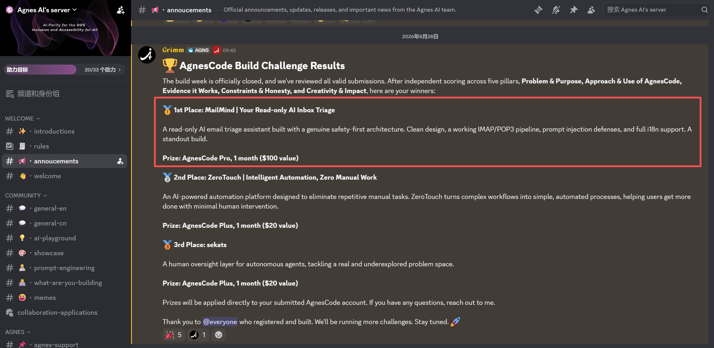

# Read-only AI Email Triage Assistant · 只读 AI 邮件分诊助手

MailMind 是一个隐私优先的 AI 邮件助手，只读、总结、分类邮件，永不发送、删除或修改。

## 🏆 获奖 · Award

**AgnesCode Build Challenge — 第 1 名 / 1st Place**

> 只读 AI 邮件分诊 · 安全优先架构 · Prompt Injection 防御 · 完整 i18n
> 奖品：AgnesCode Pro，1 个月（价值 $100） · Prize: AgnesCode Pro, 1 month ($100 value)



## 功能特性

- **只读设计**：永不发送、删除、移动或修改邮件
- **AI 分析**：自动总结、分类邮件并给出优先级建议
- **双语支持**：简体中文 / English
- **TLS 加密**：IMAP/POP3 连接强制加密
- **隐私保护**：密码仅在内存中流转，不落地存储

## 技术栈

- **前端**：Next.js 15 + React 19
- **桌面端**：Tauri 2 + Rust
- **语言**：TypeScript
- **验证**：Zod schemas
- **邮件**：IMAP/POP3 over TLS

## 快速开始

```bash
# 安装依赖
pnpm install

# 启动 Web 应用
pnpm dev:web

# 或启动桌面应用
pnpm dev:desktop
```

## 安全扫描

```bash
pnpm test:security
```

## 项目状态

AgnesCode Build Challenge 冠军项目（第 1 名 / 1st Place），核心功能（IMAP 连接、邮件分析、提示注入防御、完整 i18n）已在 Web 端实现，桌面端目前为 stub 状态。

评审五大维度：Problem & Purpose · Approach & Use of AgnesCode · Evidence it Works · Constraints & Honesty · Creativity & Impact

## 许可证

MIT License
